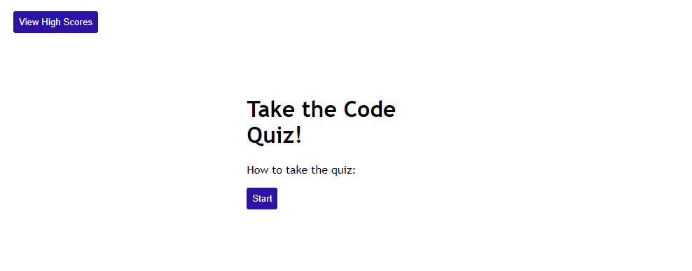
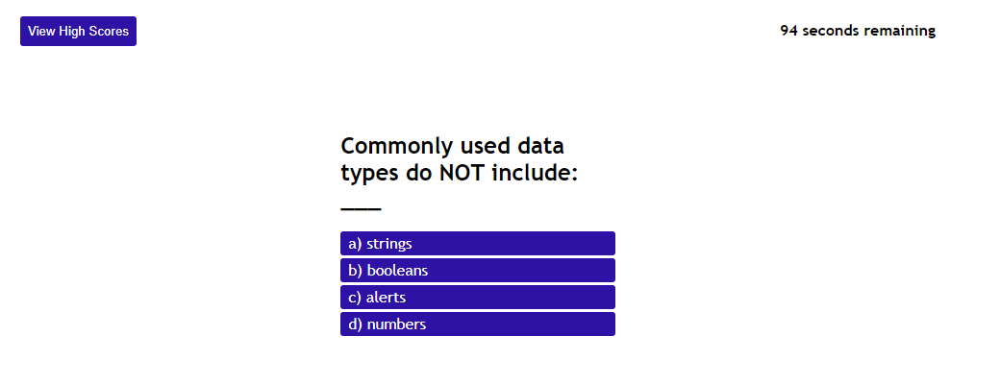
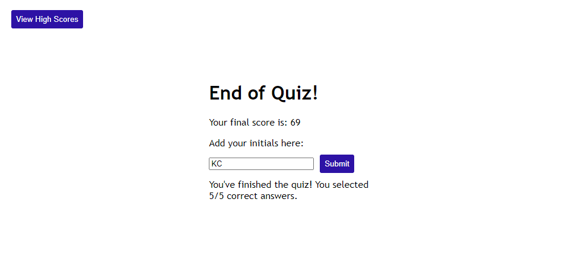
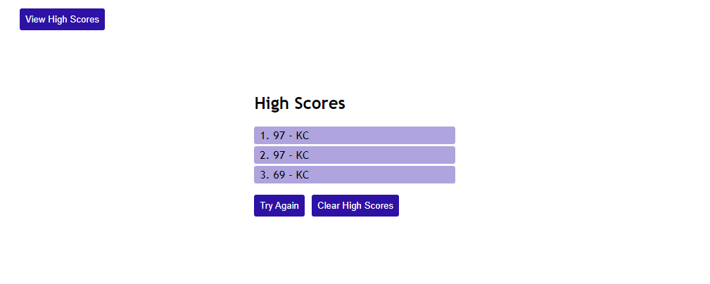

# code-quiz

## The Task

This week's homework requires a complete build of a code quiz website. The questions and answers were provided, but the HTML, CSS, and Javascript were created from scratch.

Visit the [live link](https://kelsie-c.github.io/code-quiz/) to see the final product!

## Provided User Story

```
AS A coding boot camp student
I WANT to take a timed quiz on JavaScript fundamentals that stores high scores
SO THAT I can gauge my progress compared to my peers
```

## Acceptance Criteria

```
GIVEN I am taking a code quiz
WHEN I click the start button
THEN a timer starts and I am presented with a question
WHEN I answer a question
THEN I am presented with another question
WHEN I answer a question incorrectly
THEN time is subtracted from the clock
WHEN all questions are answered or the timer reaches 0
THEN the game is over
WHEN the game is over
THEN I can save my initials and my score
```

## Mock-Up

The following images demonstrate the web application's appearance and functionality:


```

```

```
